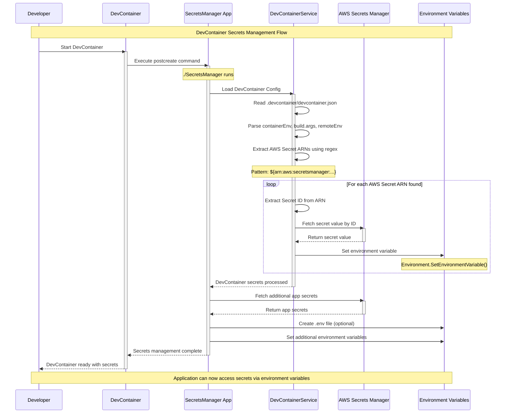

# Universal Secrets Manager Application

This application demonstrates how to integrate with AWS Secrets Manager using LocalStack for local development. It provides a complete workflow for managing secrets in a containerized development environment with Infrastructure as Code (IaC) using Terraform.

**🐍 Python & 🔷 .NET Compatible** - Works with any programming language that can read environment variables or .env files!

## 🆕 NEW: DevContainer Secrets Management

**Automatically fetch AWS secrets in your DevContainer environment!**

This project now includes advanced DevContainer integration that automatically detects AWS Secrets Manager ARNs in your DevContainer configuration and fetches the actual secret values at container startup.

### ✨ Key Features

- **🔍 Automatic ARN Detection**: Scans `devcontainer.json` for AWS Secrets Manager ARNs
- **🔄 Real-time Secret Fetching**: Retrieves actual values from AWS Secrets Manager
- **🌍 Environment Variable Injection**: Automatically sets environment variables with secret values
- **🛡️ Secure by Design**: Secrets are never stored in configuration files
- **📍 Multi-Location Support**: Works with `containerEnv`, `build.args`, and `remoteEnv`

### 🚀 How It Works

Simply add AWS Secrets Manager ARNs to your DevContainer configuration:

```json
{
  "containerEnv": {
    "GIT_TOKEN": "${arn:aws:secretsmanager:us-east-1:000000000000:secret:my-secret-abc123}",
    "API_KEY": "${arn:aws:secretsmanager:us-east-1:000000000000:secret:api-keys-def456}",
    "REGULAR_VAR": "not-a-secret"
  }
}
```

The system automatically:
1. Detects ARN patterns in your DevContainer config
2. Fetches the actual secret values from AWS Secrets Manager
3. Sets environment variables with the retrieved values
4. Your application can access secrets via standard environment variables

### 📊 DevContainer Secrets Flow Diagram



### 🧪 Comprehensive Testing

- **18 Unit Tests** covering all functionality
- **ARN Validation** and extraction testing
- **Multi-configuration** support testing
- **Error Handling** and edge case coverage

# Use Case

This project fetches secrets from AWS Secrets Manager and applies them to the local development environment as environment variables or in an `.env` file. This allows developers to easily access sensitive information without exposing it in their source code.

# How to Use
1. Create secrets in AWS Secrets Manager
2. Work in a project that expects secrets to be available as environment variables or in an `.env` file
3. ./SecretsManager fetches the secrets from AWS Secrets Manager and applies them to the local development environment

```
# validate the value
env | grep -E "(DATABASE_URL|API_KEY|JWT_SECRET|REDIS_URL)"
# or
cat src/SecretsManager/.env
```

## 🐍 Using with Python Projects

This secrets manager works seamlessly with Python projects! The tool fetches secrets from AWS and makes them available through standard mechanisms that Python can easily consume.

### Quick Start for Python Developers

1. **Download the standalone binary** (no .NET installation required):
   ```bash
   # Download the appropriate binary for your platform
   # Linux
   wget https://github.com/your-repo/releases/latest/download/SecretsManager-linux
   chmod +x SecretsManager-linux
   
   # macOS
   wget https://github.com/your-repo/releases/latest/download/SecretsManager-macos
   chmod +x SecretsManager-macos
   
   # Or build from source
   make build-linux  # or build-macos, build-windows
   ```

2. **Configure your secrets** in AWS Secrets Manager or use the provided LocalStack setup

3. **Run the secrets manager** before starting your Python application:
   ```bash
   ./SecretsManager-linux  # This creates .env file and sets environment variables
   ```

4. **Access secrets in your Python application**:

### Method 1: Using Environment Variables

```python
import os

# Access secrets that were set as environment variables
database_url = os.getenv('DATABASE_URL')
api_key = os.getenv('API_KEY')
jwt_secret = os.getenv('JWT_SECRET')
redis_url = os.getenv('REDIS_URL')

print(f"Database URL: {database_url}")
```

### Method 2: Using .env Files with python-dotenv

```bash
# Install python-dotenv
pip install python-dotenv
```

```python
from dotenv import load_dotenv
import os

# Load environment variables from .env file
load_dotenv()

# Access the secrets
database_url = os.getenv('DATABASE_URL')
api_key = os.getenv('API_KEY')
jwt_secret = os.getenv('JWT_SECRET')
redis_url = os.getenv('REDIS_URL')

print(f"Database URL: {database_url}")
```

### Method 3: DevContainer Integration for Python

Configure your Python DevContainer to automatically fetch secrets:

```json
{
  "name": "Python Development Environment",
  "image": "python:3.11",
  "containerEnv": {
    "DATABASE_URL": "${arn:aws:secretsmanager:us-east-1:123456789012:secret:db-url-abc123}",
    "API_KEY": "${arn:aws:secretsmanager:us-east-1:123456789012:secret:api-key-def456}",
    "OPENAI_API_KEY": "${arn:aws:secretsmanager:us-east-1:123456789012:secret:openai-key-ghi789}"
  },
  "postCreateCommand": "pip install -r requirements.txt"
}
```

Your Python code can then access these directly:
```python
import os

# These are automatically available as environment variables
openai_key = os.getenv('OPENAI_API_KEY')
database_url = os.getenv('DATABASE_URL')
```

### Integration Patterns for Python Projects

#### 1. Startup Script Pattern
```python
# startup.py
import subprocess
import sys
import os

def fetch_secrets():
    """Fetch secrets before starting the main application"""
    try:
        # Run the secrets manager
        result = subprocess.run(['./SecretsManager'], 
                              capture_output=True, text=True, check=True)
        print("✅ Secrets fetched successfully")
        return True
    except subprocess.CalledProcessError as e:
        print(f"❌ Failed to fetch secrets: {e}")
        return False

if __name__ == "__main__":
    if fetch_secrets():
        # Import and run your main application
        from your_app import main
        main()
    else:
        sys.exit(1)
```

#### 2. Docker Container Pattern

**Using Environment Variables:**
```dockerfile
# Dockerfile for Python app
FROM python:3.11-slim

# Copy the secrets manager binary
COPY dist/linux/SecretsManager /usr/local/bin/SecretsManager
RUN chmod +x /usr/local/bin/SecretsManager

# Copy your Python application
COPY . /app
WORKDIR /app

# Install Python dependencies
RUN pip install -r requirements.txt

# Create startup script that fetches secrets then runs Python app
RUN echo '#!/bin/bash\n/usr/local/bin/SecretsManager && python main.py' > /start.sh
RUN chmod +x /start.sh

CMD ["/start.sh"]
```

**Docker Compose with Environment Variables:**
```yaml
# docker-compose.yml
version: '3.8'
services:
  app:
    build: .
    environment:
      # AWS credentials via environment variables
      AWS_ACCESS_KEY_ID: ${AWS_ACCESS_KEY_ID}
      AWS_SECRET_ACCESS_KEY: ${AWS_SECRET_ACCESS_KEY}
      AWS_DEFAULT_REGION: us-east-1
      # Or .NET-style variables
      AWS__Region: us-east-1
      AWS__ServiceURL: http://localstack:4566
      SecretsManager__SecretName: my-app-secrets
    networks:
      - app-network

  localstack:
    image: localstack/localstack
    environment:
      - SERVICES=secretsmanager,sts,iam
      - DOCKER_HOST=unix:///var/run/docker.sock
    ports:
      - "4566:4566"
    networks:
      - app-network

networks:
  app-network:
    driver: bridge
```

#### 3. CI/CD Pipeline Pattern
```yaml
# .github/workflows/deploy.yml
steps:
  - name: Fetch Secrets
    run: |
      # Download and run secrets manager
      wget https://github.com/your-repo/releases/latest/download/SecretsManager-linux
      chmod +x SecretsManager-linux
      ./SecretsManager-linux
      
  - name: Run Python Tests
    run: |
      # Secrets are now available as environment variables
      python -m pytest
    env:
      # Secrets are automatically available from previous step
```

### Python-Specific Configuration

You can configure the secrets manager for Python projects by setting environment variables instead of using appsettings.json:

```bash
export AWS__REGION="us-east-1"
export AWS__SERVICEURL="http://localhost:4566"
export AWS__ACCESSKEY="test"
export AWS__SECRETKEY="test"
export SECRETSMANAGER__SECRETNAME="python-app-secrets"

./SecretsManager
```

## 🚀 Quick Start to Validate this Project

1. **Start the infrastructure**: `make setup-infrastructure`
2. **Build and run the application**: `make test-app`
3. **Check the generated `.env` file and environment variables**

## 🏗️ Project Architecture Overview

```
┌─────────────────┐    ┌─────────────────┐    ┌─────────────────┐
│ Secrets Manager │    │   LocalStack    │    │   Terraform     │
│   (Universal)   │    │                 │    │                 │
│ ┌─────────────┐ │    │ ┌─────────────┐ │    │ ┌─────────────┐ │
│ │ Secrets     │ │◄──►│ │ Secrets     │ │◄──►│ │ IaC         │ │
│ │ Service     │ │    │ │ Manager     │ │    │ │ Deployment  │ │
│ └─────────────┘ │    │ └─────────────┘ │    │ └─────────────┘ │
│                 │    │                 │    │                 │
│ ┌─────────────┐ │    │ ┌─────────────┐ │    │                 │
│ │ DevContainer│ │    │ │ IAM/STS     │ │    │                 │
│ │ Service     │ │    │ │ Services    │ │    │                 │
│ └─────────────┘ │    │ └─────────────┘ │    │                 │
└─────────────────┘    └─────────────────┘    └─────────────────┘
        │
        ▼
┌─────────────────────────────────────────────────────────────────┐
│                    Your Applications                            │
│  ┌─────────────┐  ┌─────────────┐  ┌─────────────┐  ┌─────────┐ │
│  │   Python    │  │    .NET     │  │   Node.js   │  │   Go    │ │
│  │     App     │  │     App     │  │     App     │  │   App   │ │
│  └─────────────┘  └─────────────┘  └─────────────┘  └─────────┘ │
│         │                │                │              │     │
│         ▼                ▼                ▼              ▼     │
│  ┌─────────────────────────────────────────────────────────────┐ │
│  │        Environment Variables & .env Files                  │ │
│  └─────────────────────────────────────────────────────────────┘ │
└─────────────────────────────────────────────────────────────────┘
```

## 🛠️ Available Commands

### Infrastructure Management
- `make start` - Start LocalStack containers
- `make stop` - Stop LocalStack containers
- `make restart` - Restart LocalStack containers
- `make status` - Show container status
- `make setup-infrastructure` - Deploy complete infrastructure (LocalStack + Terraform)

### Development Commands
- `make dotnet-build` - Build the .NET application
- `make dotnet-run` - Build and run the .NET application
- `make dotnet-clean` - Clean .NET build artifacts
- `make full-setup` - Complete setup (infrastructure + application build)

### Testing & Validation
- `make test` - Run unit tests
- `make dotnet-test` - Run unit tests (alternative)
- `make test-app` - Run end-to-end application test
- `make health-check` - Run comprehensive health diagnostics
- `make localstack-status` - Check LocalStack service status
- `make test-secrets` - Test direct secret retrieval

# Example Usage
## ⚙️ Configuration

### DevContainer Secrets Configuration

This project assumes your devcontainer will have access to AWS Secrets Manager ARNs.
This can be achieved by your runtime already having authenticated to AWS via OIDC, or by authenticating to AWS from within the devcontainer.
Configure AWS Secrets Manager ARNs directly in your `devcontainer.json`:

```json
{
  "name": "My Development Environment",
  "containerEnv": {
    "DATABASE_PASSWORD": "${arn:aws:secretsmanager:us-east-1:123456789012:secret:db-password-abc123}",
    "API_TOKEN": "${arn:aws:secretsmanager:us-east-1:123456789012:secret:api-token-def456}",
    "REGULAR_CONFIG": "not-a-secret"
  },
  "build": {
    "args": {
      "BUILD_SECRET": "${arn:aws:secretsmanager:us-east-1:123456789012:secret:build-secret-ghi789}"
    }
  },
  "remoteEnv": {
    "REMOTE_KEY": "${arn:aws:secretsmanager:us-east-1:123456789012:secret:remote-key-jkl012}"
  }
}
```

**Supported ARN Locations:**
- `containerEnv` - Environment variables for the container
- `build.args` - Build-time arguments
- `remoteEnv` - Remote environment variables

### Application Configuration

The application can be configured through `appsettings.json` or **environment variables**.

#### Configuration via appsettings.json

```json
{
  "AWS": {
    "Region": "us-east-1",
    "ServiceURL": "http://localhost:4566",
    "AccessKey": "test",
    "SecretKey": "test"
  },
  "SecretsManager": {
    "SecretName": "dotnet-app-secrets",
    "OutputMode": "Both",
    "EnvFilePath": ".env",
    "EnvExamplePath": ".env.example"
  }
}
```

#### Configuration via Environment Variables

The application now supports configuration through environment variables, which take precedence over `appsettings.json`:

**🔷 .NET-style environment variables:**
```bash
export AWS__Region="us-east-1"
export AWS__ServiceURL="http://localhost:4566"
export AWS__AccessKey="your-access-key"
export AWS__SecretKey="your-secret-key"
export SecretsManager__SecretName="my-app-secrets"
export SecretsManager__OutputMode="Both"
```

**🌐 AWS SDK standard environment variables:**
```bash
export AWS_ACCESS_KEY_ID="your-access-key"
export AWS_SECRET_ACCESS_KEY="your-secret-key"
export AWS_DEFAULT_REGION="us-east-1"  # or AWS_REGION
```

**📊 Configuration Precedence Order:**
1. .NET-style environment variables (`AWS__*`, `SecretsManager__*`)
2. AWS SDK standard environment variables (`AWS_*`)
3. Values from `appsettings.json`

**🔐 IAM Role Support:**
If no explicit credentials are provided, the application will use the AWS SDK credential chain, which includes:
- IAM roles for EC2 instances
- IAM roles for ECS tasks
- IAM roles for Lambda functions
- AWS credentials file (~/.aws/credentials)

**Configuration Options:**
- `SecretName`: Name of the secret in AWS Secrets Manager
- `Region`: AWS region (default: us-east-1)
- `ServiceURL`: LocalStack endpoint URL (leave empty for real AWS)
- `AccessKey`/`SecretKey`: AWS credentials (optional with IAM roles)
- `OutputMode`: How to output secrets (`EnvironmentVariables`, `EnvFile`, or `Both`)
- `EnvFilePath`: Path for the .env file output
- `EnvExamplePath`: Path to .env.example file for ARN detection

### Secret Management

Secrets are managed through Terraform variables in `terraform/variables.tf`:

```hcl
variable "secrets" {
  description = "Map of secrets to create"
  type = map(object({
    name        = string
    description = string
    secret_data = map(string)
  }))
  default = {
    app_secrets = {
      name        = "dotnet-app-secrets"
      description = "Application secrets for .NET app"
      secret_data = {
        database_url    = "postgresql://localhost:5432/mydb"
        api_key        = "your-api-key-here"
        jwt_secret     = "your-jwt-secret"
        redis_url      = "redis://localhost:6379"
      }
    }
  }
}
```

```bash
make health-check
```

This will check:
- ✅ LocalStack service status
- ✅ Secrets Manager availability
- ✅ Secret retrieval functionality
- ✅ Docker container health
- ✅ Network connectivity
- ✅ DevContainer configuration validation


## 🚀 Production Considerations

### Security
- Replace default credentials in production
- Use proper AWS IAM roles and policies
- Implement secret rotation
- Enable encryption at rest and in transit
- **✨ DevContainer secrets are fetched at runtime, never stored in config**

### Scalability
- Consider using AWS ECS/EKS for container orchestration
- Implement proper logging and monitoring
- Use AWS Application Load Balancer for high availability
- Implement circuit breakers and retry policies

### Monitoring
- Add health check endpoints
- Implement structured logging
- Use AWS CloudWatch for monitoring
- Set up alerting for secret retrieval failures
- **✨ Monitor DevContainer secret fetch operations**

## 📚 Additional Resources

### General
- [AWS Secrets Manager Documentation](https://docs.aws.amazon.com/secretsmanager/)
- [LocalStack Documentation](https://docs.localstack.cloud/)
- [Terraform AWS Provider](https://registry.terraform.io/providers/hashicorp/aws/latest/docs)
- [VS Code Dev Containers](https://code.visualstudio.com/docs/devcontainers/containers)

### Python-Specific
- [python-dotenv Documentation](https://pypi.org/project/python-dotenv/)
- [Python os.environ Documentation](https://docs.python.org/3/library/os.html#os.environ)
- [Python subprocess Documentation](https://docs.python.org/3/library/subprocess.html)
- [Python Docker Best Practices](https://docs.docker.com/develop/dev-best-practices/)

### .NET-Specific
- [.NET Configuration Documentation](https://docs.microsoft.com/en-us/dotnet/core/extensions/configuration)

## 📄 License

This project is licensed under the MIT License - see the LICENSE file for details.

---

**Happy coding! 🎉**
